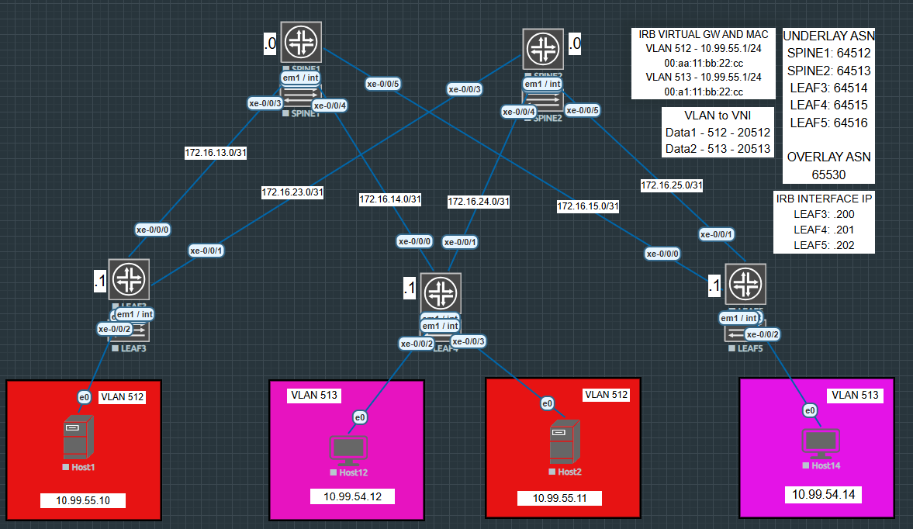

# Juniper EVPN-VXLAN Lab (EVE-NG)

This repo showcases a fully functional Juniper-based EVPN-VXLAN lab deployed in EVE-NG. The goal is to simulate a data center fabric using eBGP underlay, iBGP overlay, Anycast IRB gateways, and VXLAN-based Layer 2 extensions.

---

---

## Objectives

- Build a scalable EVPN-VXLAN fabric with Junos vQFX
- Use eBGP underlay with iBGP overlay
- Map VLANs to VNIs and configure IRBs for L3 gateway
- Simulate real-world data center segmentation and host reachability

---

## Topology Summary

- Spines: 2 (route reflectors)
- Leafs: 3 (Leaf3, Leaf4, Leaf5)
- Hosts: 4 connected to Leaf switches

---

## Configuration Steps

1. Global Parameters  
   Common system settings and reusable policies, including router IDs, hostnames, export policies and load balancing policies. 

2. Underlay (eBGP)  
   Interface-based BGP between leafs and spines using loopbacks

3. Overlay (iBGP + EVPN)  
   EVPN sessions between leafs using spines as route reflectors

4. VLAN to VNI Mapping  
   VLAN 512 -> VNI 20512  
   VLAN 513 -> VNI 20513

5. IRB and Anycast Gateway  
   Same IRB IP and MAC across leafs using `virtual-gateway-v4-mac`

6. VXLAN Bridging  
   EVPN/VXLAN-based L2 bridging across hosts in the same VLAN

## Repository Structure

| Folder      | Description                          |
|-------------|--------------------------------------|
| `topology/` | Topology diagram                     |
| `configs/`  | Junos configuration files per device |
| `notes/`    | Step-by-step configuration notes     |
| `eve-ng/`   | EVE-NG lab export file               |

---

## Background

This project was built while studying for the JNCIA-DC certification and testing out EVPN-VXLAN concepts using EVE-NG and Juniper vQFX images. It helped reinforce how control-plane and data-plane interact in modern data center networks.

---

